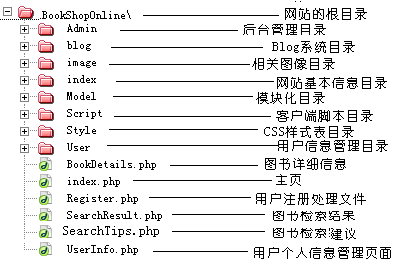

# 使用说明

## 网上书店

**作者：安徽大学06NET小强**

** 声明：该实例仅供学习研讨，不允许用作任何商业用途，谢谢合作！**

### 1 本网上书店的技术平台为：

	操作系统      ：Windows XP SP2

	服务器        ：Apache2.2

	服务器语言    ：PHP5

	数据库服务器  ：MySql5.1

	客户端脚本语言：Ajax，也可以说是JavaScript

	客户端浏览器  ：IE 8.0、Mozilla Firefox 1.9以及Opera 10.0

### 2 相关参数说明：

**文档目录参数**

	网站根目录：BookShopOnline

	数据库文件：BookShop

**相关说明：**

	1)数据库连接字符串：BookShopOnline\Model\conn.php

	2)文档相对路径寻址设置：<base href="http://localhost/bookshoponline/" />标签的属性设置，其相关文件包括：index.php、BookDetails.php、UserInfo.php、SearchResult.php、AdminLogin.php、Admin.php等

### 3 网上书店文档树形结构示意图

